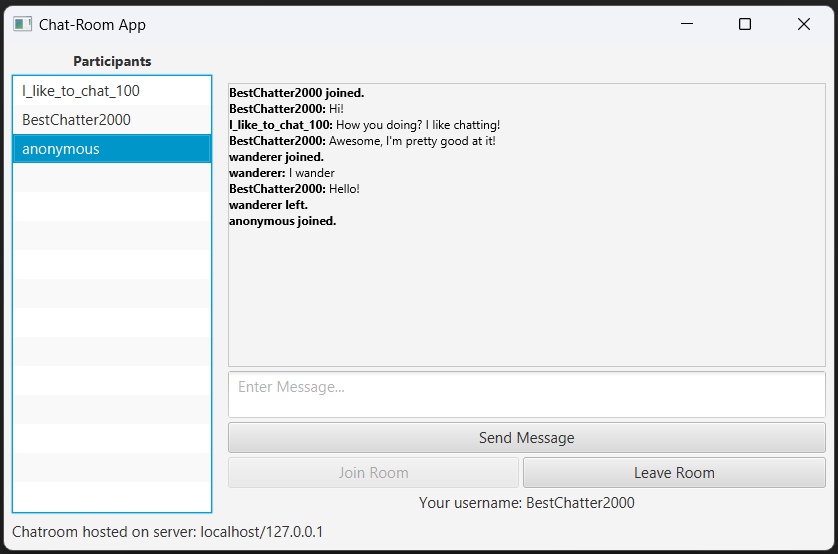
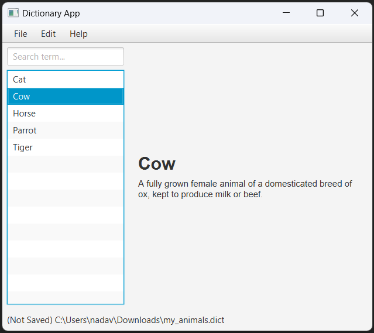
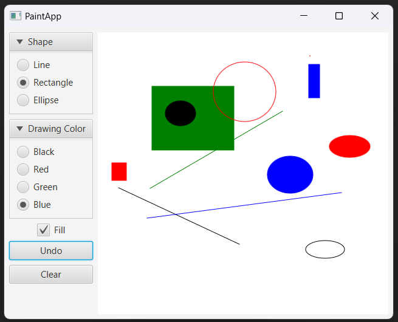
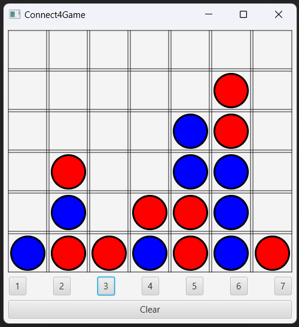

# JavaFX Projects

This repository contains selected JavaFX projects I worked on as part of an advanced Java programming course I took at OUI in spring 2022.

## Multithreaded Chatroom

## Glossary Editor App

## Simple Paint App

# Connect-4 Game

